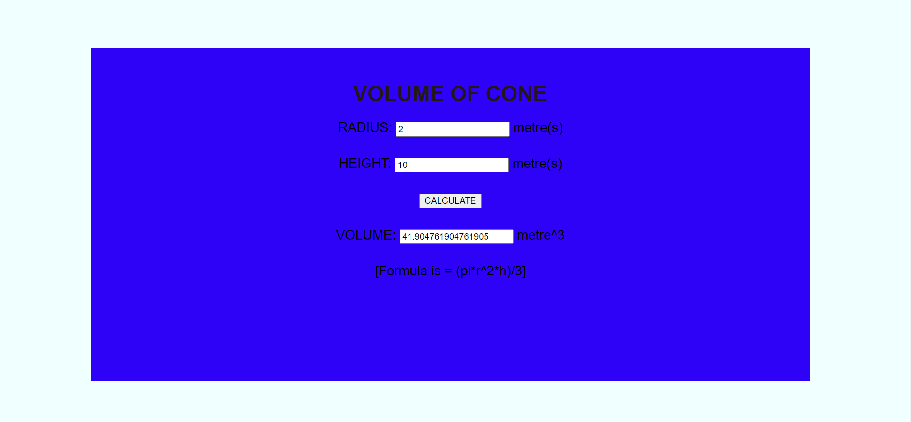
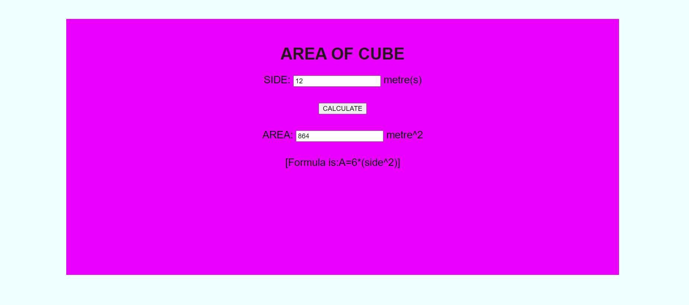

# Web Page for Mathematical Calculations

## AIM:

To design a static website with validation to perform mathematical calculations in client side.

## DESIGN STEPS:

### Step 1:

Requirement collection.

### Step 2:

Creating the layout using HTML and CSS.

### Step 3:

Write javascript to perform the calculations.

### Step 4:

Include regularexpression based input validation.

### Step 5:

Validate the layout in various browsers.

### Step 6:

Validate the HTML code.

### Step 6:

Publish the website in the given URL.

## PROGRAM :
```
<!DOCTYPE html>
<html lang="en">
<head>

    <title>Volume</title>
    <style>
        * {
  box-sizing: border-box;
  font-family: Arial, Helvetica, sans-serif;
}
body {
  background-color:azure;
}
.container {
  width: 1080px;
  margin-left: auto;
  margin-right: auto;
}
.content {
  display: block;
  width: 100%;
  background-color: rgb(47, 2, 248);
  min-height: 500px;
  margin-top: 150px;
}
.content2{
    display: block;
    width: 100%;
    background-color: rgb(234, 0, 255);
    min-height: 500px;
    margin-top: 150px;
    margin-bottom: 150px;
}
h1{
    text-align: center;
    padding-top: 50px;
    color: rgb(36, 23, 23);
}
.formelement{
    text-align: center;
    font-size: 20px;
    margin-top: 5px;
    margin-bottom: 5px;

}
    </style>
</head>
<body>
    <div class="container">
        <div class="content">
            <h1>VOLUME OF CONE</h1>
            <form>
                <div class=formelement>
                    <lable for="aedit">RADIUS:</lable>
                    <input type="text" id="aedit" value="0"/>
                    <lable>metre(s)</lable>
                </div><br>
                <div class=formelement>
                    <lable for="bedit">HEIGHT:</lable>
                    <input type="text" id="bedit" value="0"/>
                    <lable>metre(s)</lable>
                </div><br>
                <div class=formelement>
                    <input type="button" value="CALCULATE" id="calbutton"/>
                </div><br>
                <div class=formelement>
                    <lable for="cedit">VOLUME:</lable>
                    <input type="text" id="cedit" value="0"/>
                    <lable>metre^3</lable>
                </div><br>
                <div class=formelement>
                    [Formula is = (pi*r^2*h)/3]
                </div>
            </form>
        </div>
        <script type="text/javascript">
            var button;
            button=document.querySelector("#calbutton");
            button.addEventListener("click",function(){
                var atext,btext,ctext;
                var aval,bval,cval;
                atext=document.querySelector("#aedit");
                btext=document.querySelector("#bedit");
                ctext=document.querySelector("#cedit");

                aval=parseInt(atext.value);
                bval=parseInt(btext.value);
                cval=((22/7)*(aval**2)*(bval))/3;
                ctext.value=""+cval;
            });
        </script>
        <div class="content2">
            <h1>AREA OF CUBE</h1>
            <form>
                <div class="formelement">
                  <lable for="radiusedit">SIDE:</lable>
                  <input type="text" id="radiusedit" value="0"/>
                  <lable>metre(s)</lable>
                </div><br>
                <div class="formelement">
                  <input type="button" value="CALCULATE" id="calbutton2"/>
                </div><br>
                <div class="formelement">
                  <lable for="volumeedit">AREA:</lable>
                  <input type="text" id="volumeedit" value="0"/>
                  <lable>metre^2</lable>
                </div><br>
                <div class="formelement">
                [Formula is:A=6*(side^2)]
                </div><br>
                
            </form>
    
            </div>
        </div>
        <script type="text/javascript">
          var button;
          button=document.querySelector("#calbutton2");
          button.addEventListener("click",function(){
            
              var radiustext,heighttext,volumetext;
              var aval,bval,cval;
    
              radiustext=document.querySelector("#radiusedit");
              heighttext=document.querySelector("#heightedit");
              volumetext=document.querySelector("#volumeedit");
      
              aval=parseInt(radiustext.value);
              cval=6*(aval**2);
              volumetext.value=""+cval;
        
      
            });
      
        </script>     

    
</body>
</html>
```


## OUTPUT:




## Result:

Thus a website is designed to perform mathematical calculations in the client side.
